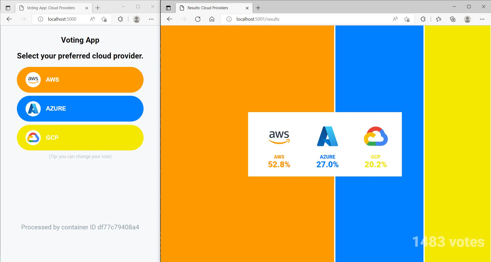

# Cloud Native (Foundational) - Final Project Resources

## I. Prerequisite

1. [Rancher Desktop](https://rancherdesktop.io/) - Recommended
   Rancher Desktop is delivered as a desktop application. You can download it from the releases page on GitHub.  
   After Rancher Desktop is installed, users will have access to these supporting utilities:
   - Docker / Containerd
   - Docker Compose
   - Kubernetes (kubectl)
   - Helm

## II. Case Study - Lets Vote!
Stratpoint developed a new application that will be used as an internal tool for deciding what cloud provider they will be focusing on. The application is composed of two main services: (a) one that is serving the voting web app written in Python, and (b) one that is serving a real-time dashboard written in Javascript. Redis will also be part of the deployment and is used as a caching solution together with a custom-built worker that will handle writes to the PostgreSQL database. Currently, the application is running on a single EC2 instance leveraging Docker and Compose. They want to migrate the existing application to a Kubernetes environment.

- Req. 1 – Build, tag, and push container image for each component.
- Req. 2 – Ensure that all packages and container artifacts pass a security/vulnerability scan.
- Req. 3 – Create manifest files for the containerized workload and deploy them in a cluster.
- Req. 4 – Make use of configmap and secrets as best practices (especially for credentials).
- Req. 5 – Write documentation discussing the things you have done to complete the project.

### Architecture

## III. Instructions

1. Create a private GitLab/GitHub repository. Store/push all the requirements here.  
    Share the repository to the following email addresses:  
        - Kevin Ventura <kventura@stratpoint.com>  
        - Romar Cablao <rcablao@stratpoint.com>  
2. Create Dockerfile for each application (vote-webapp result-webapp, and worker).  
    Note: Application code will be provided except for Dockerfile.
3. Build, tag and store container images in a container registry.
4. Create Kubernetes manifest file for each app deployment.
5. As a best practice, have the secrets and configuration stored in secrets and configmap respectively. Have those mounted in the pod by adding configuration in the manifest files.
6. Expose the webtool using a service or ingress.
7. Simulate an application release by doing a change in the code, have it built into the container image (incrementing the tag/version), and deploy in Kubernetes. (Optional: Change the number of replicas to test scaling in/out)
8. Document the steps you’ve done to fulfill the above requirements. Include screenshots of an explanation in the README.md file together with what you’ve done to complete the application migration. Rationale: Devs/engineers need to understand the value of writing documentation, and this is one of Stratizen’s performance metrics.

### Expected Output

## IV. Additional Notes
> Compose files are provided. Once you created/modified Dockerfiles, you can use these in testing and running the containers.  
Doing so will help you understand how these services connects to one another. 

> Worker Dockerfile is already provided for you. The rest are up to you to create - notes are included as guide.